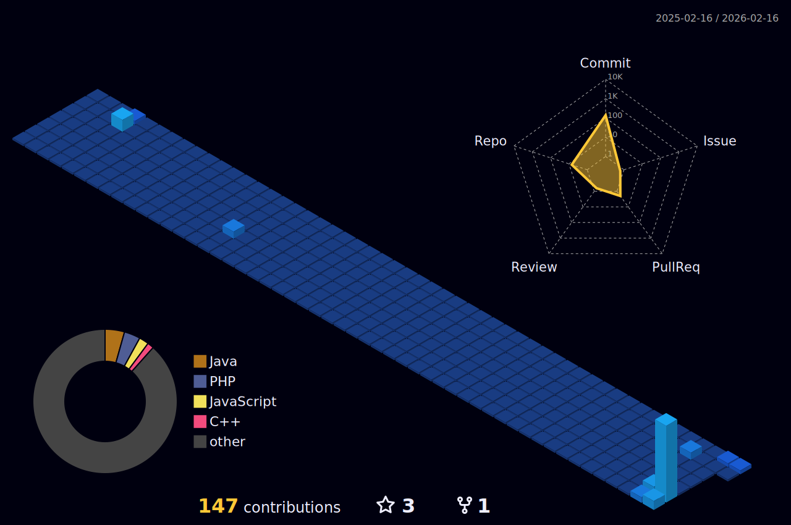

<h1 align="center">Yo! I am Nithija Kalpa 👋</h1>

Just tech ! ✌️ 
Testing arch btw 🐧⚔️....

---

<h2 align="center">🚀 TECH STACK</h2>

<h3 align="center">Frontend</h3>

<h3 align="center">Backend</h3>

<h3 align="center">Tools & IDE</h3>

---

<h2 align="center">🧠 SYSTEM VISUAL CORE</h2>

---

<h2 align="center">🔥 Developer Dashboard</h2>

<table align="center">
<tr>

<td>

</td>

<td>

</td>

</tr>
</table>

---

<h2 align="center">⚡ Activity Panel</h2>

<table align="center">
<tr>

<td>

</td>

<td>

</td>

</tr>
</table>

---

<h2 align="center">🌌 3D Contribution Graph</h2>

---

