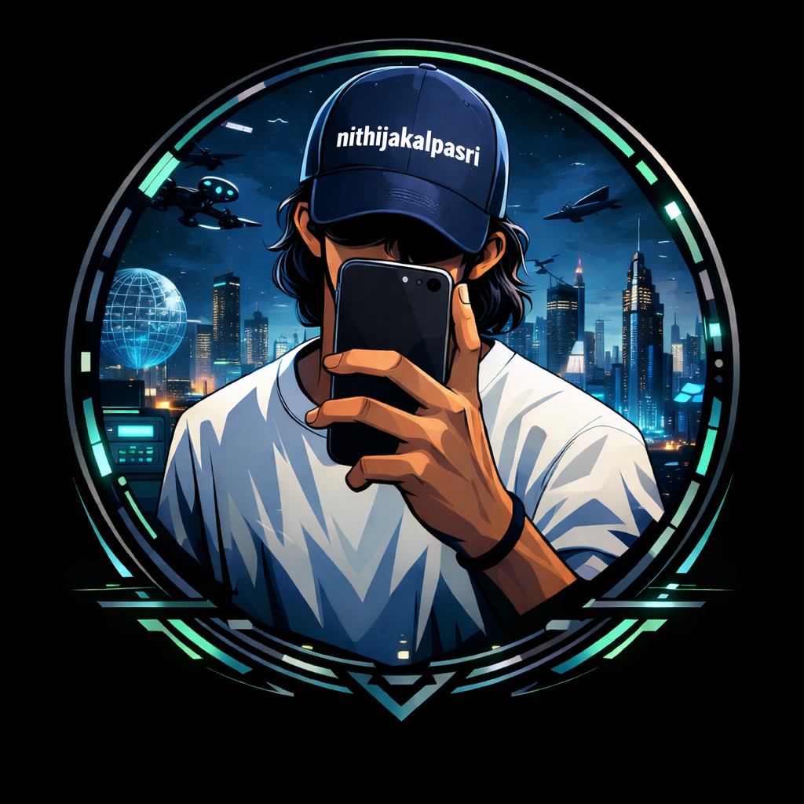

## Hi there 👋
## I am Nithija Kalpa 

  

<table align="center" style="border:none;">
<tr style="border:none;">

<td style="border:none;">

</td>

<td width="30"></td>

<td style="border:none;">

</td>

<td width="30"></td>

<td style="border:none;">

</td>

<td width="30"></td>

<td style="border:none;">

</td>

</tr>
</table>

<b style="font-size:50px;">🔥 Developer Dashboard </b>

<b style="font-size:50px;">🔥 Coding Streak</b>

<!--
**NithijaKalpaSri/NithijaKalpaSri** is a ✨ _special_ ✨ repository because its `README.md` (this file) appears on your GitHub profile.

Here are some ideas to get you started:

- 🔭 I’m currently working on ...
- 🌱 I’m currently learning ...
- 👯 I’m looking to collaborate on ...
- 🤔 I’m looking for help with ...
- 💬 Ask me about ...
- 📫 How to reach me: ...
- 😄 Pronouns: ...
- ⚡ Fun fact: ...
-->
